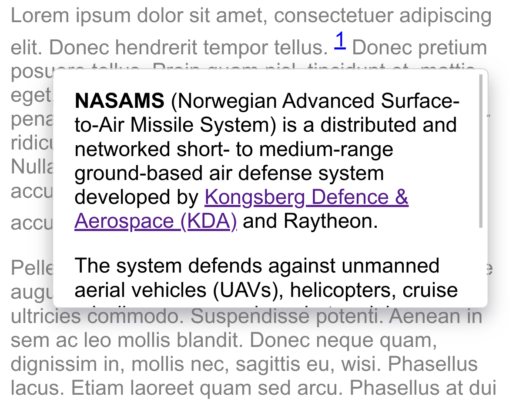

# endnotes

A tiny, vanilla JavaScript popup footnotes library.

* No dependencies
* 3.5KB unminified

Demo: https://gromnitsky.users.sourceforge.net/js/examples/endnotes/example.html

## Usage

    $ npm i endnotes

html:

~~~

  this requires an explanation <a class="footnote" href="#foo">1</a>

  hello

~~~

js:

~~~

~~~

This adds event listeners to everything that matches `a.footnote`
selector. When a user hovers over a link, it extracts inner html from
the place to which the link's href points & displays a popup.

The latter implies a local source of data, but you can provide your own
function for the data extraction:

    footnotes('a.footnote', {ref: myfunc})

`myfunc` will get 1 argument: a value of `href` attribute of an
hovered element.

Other possible options: `width` & `height` for the popup window.

## License

MIT
